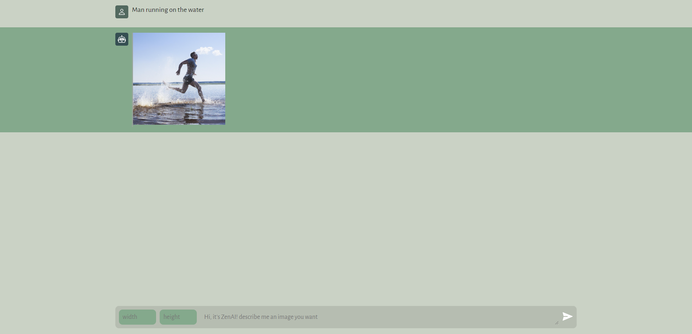

<a name="readme-top"></a>
<div align="center">

  
  

  <h1>ZenAI DALL-E GPT</h1>
  
  <p>
    ZenAI is your digital image generator AI assistant, JavaScript ChatGPT AI app using OpenAI DALL-E ML models.
  </p>

<!-- Badges -->
<p>
  <a href="https://github.com/ladunjexa/ZenAI-GPT-Dall-E/graphs/contributors">
    
  </a>
  <a href="">
    
  </a>
  <a href="https://github.com/ladunjexa/ZenAI-GPT-Dall-E/network/members">
    
  </a>
  <a href="https://github.com/ladunjexa/ZenAI-GPT-Dall-E/stargazers">
    
  </a>
  <a href="https://github.com/ladunjexa/ZenAI-GPT-Dall-E/issues/">
    
  </a>
  <a href="https://github.com/ladunjexa/ZenAI-GPT-Dall-E/blob/master/LICENSE">
    
  </a>
</p>
   
 <h4>
    <a href="https://zen-ai-gpt-dall-e.vercel.app/">View Demo</a>
  <span> · </span>
    <a href="https://github.com/ladunjexa/ZenAI-GPT-Dall-E">Documentation</a>
  <span> · </span>
    <a href="https://github.com/ladunjexa/ZenAI-GPT-Dall-E/issues/">Report Bug</a>
  <span> · </span>
    <a href="https://github.com/ladunjexa/ZenAI-GPT-Dall-E/issues/">Request Feature</a>
  </h4>
</div>

<br />

<!-- Table of Contents -->
<details>

<summary>

# :notebook_with_decorative_cover: Table of Contents

</summary>

- [About the Project](#star2-about-the-project)
  * [Folder Structure](#bangbang-folder-structure)
  * [Environment Variables](#key-environment-variables)
  * [Tech Stack](#space_invader-tech-stack)
- [Getting Started](#toolbox-getting-started)
  * [Installation](#gear-installation)
  * [Run Locally](#running-run-locally)
- [Contributing](#wave-contributing)
- [License](#warning-license)
- [Contact](#handshake-contact)
- [Acknowledgements](#gem-acknowledgements)

</details>  

<!-- About the Project -->
## :star2: About the Project

<div align="center"> 
  
</div>
<br />

ZenAI is a VanillaJS ChatGPT AI app that resembles the DALL-E app with the ability to ask the AI for generate digital images from natural language descriptions.

<!-- Folder Structure -->
### :bangbang: Folder Structure

The folder structure of ZenAI is separated into server-side and client-side.
```
ZenAI-GPT-Dall-E/
|- client/
  |-- assets/
  |-- public/
  |-- index.html
  |-- package.json
  |-- script.js
  |-- style.css
|- server/
  |-- package.json
  |-- server.js
  |-- .env
```

Now, lets dive into the server and client folders.

#### client

`index.html` - `style.css` - `script.js`

Responsive layouts with CSS and elegant UI (User Interface) that resembles the DALL-E app & communication with advanced GPT-3 model API using DALL-E

#### server

`server.js` - `.env`

Node.js used for the server-side, VanillaJS code using OpenAI DALL-E models, handle events with JS.
<br />

<!-- ENV VARIABLES -->
### :key: Environment Variables

In order to use ZenAI you have to create your OpenAI api key [here](https://openai.com/api), to run this web app, you will need to add the following environment variable to your .env file

`OPENAI_API_KEY`

<!-- TechStack -->
### :space_invader: Tech Stack


<p align="right">(<a href="#readme-top">back to top</a>)</p>

<!-- Getting Started -->
## 	:toolbox: Getting Started

<!-- Installation -->
### :gear: Installation

#### Step 1:
Download or clone this repo by using the link below:

```bash
 https://github.com/ladunjexa/ZenAI-GPT-Dall-E
```

#### Step 2:

LunaAI using NPM (Node Package Manager), therefore, make sure that Node.js is installed by execute the following command in console:

```bash
  node -v
```

#### Step 3:

Go to client & server folders and execute the following command in console to get the required dependencies:

```bash
  npm install
```

#### Step 4:

Within the server-side folder create a file named `.env` and add the following [environment variable](#key-environment-variables):


```bash
  OPENAI_API_KEY=<YOUR_API_KEY>
```


<!-- Run Locally -->
### :running: Run Locally

#### Step 1:

Go to server folder and execute the following command in console to get the required dependencies:

```bash
  npm run server
```

#### Step 2:

Go to client folder and execute the following command in console to get the required dependencies:

```bash
  npm run dev
```


<p align="right">(<a href="#readme-top">back to top</a>)</p>

<!-- Contributing -->
## :wave: Contributing

<a href="https://github.com/ladunjexa/ZenAI-GPT-Dall-E/graphs/contributors">
  
</a>


Contributions are always welcome!

See [`contributing.md`](https://contributing.md/) for ways to get started.

Contributions are what make the open source community such an amazing place to learn, inspire, and create. Any contributions you make are **greatly appreciated**.

If you have a suggestion that would make this better, please fork the repo and create a pull request. You can also simply open an issue with the tag "enhancement".
Don't forget to give the project a star! Thanks again!

1. Fork the Project
2. Create your Feature Branch (`git checkout -b feature/AmazingFeature`)
3. Commit your Changes (`git commit -m 'Add some AmazingFeature'`)
4. Push to the Branch (`git push origin feature/AmazingFeature`)
5. Open a Pull Request

<p align="right">(<a href="#readme-top">back to top</a>)</p>

<!-- License -->
## :warning: License

Distributed under the MIT License. See [LICENSE.txt](https://github.com/ladunjexa/ZenAI-GPT-Dall-E/blob/main/LICENSE) for more information.

<p align="right">(<a href="#readme-top">back to top</a>)</p>

<!-- Contact -->
## :handshake: Contact

Liron Abutbul - [@lironabutbul6](https://twitter.com/lironabutbul6) - [@ladunjexa](https://t.me/ladunjexa)

Project Link: [https://github.com/ladunjexa/ZenAI-GPT-Dall-E](https://github.com/ladunjexa/ZenAI-GPT-Dall-E)

<p align="right">(<a href="#readme-top">back to top</a>)</p>

<!-- Acknowledgments -->
## :gem: Acknowledgements

This section used to mention useful resources and libraries that used in ZenAI ChatGPT DALL-E

 - [OpenAI API](https://openai.com/api)
 - [Google Fonts](https://fonts.google.com/)
 - #JSMastery

<p align="right">(<a href="#readme-top">back to top</a>)</p>
